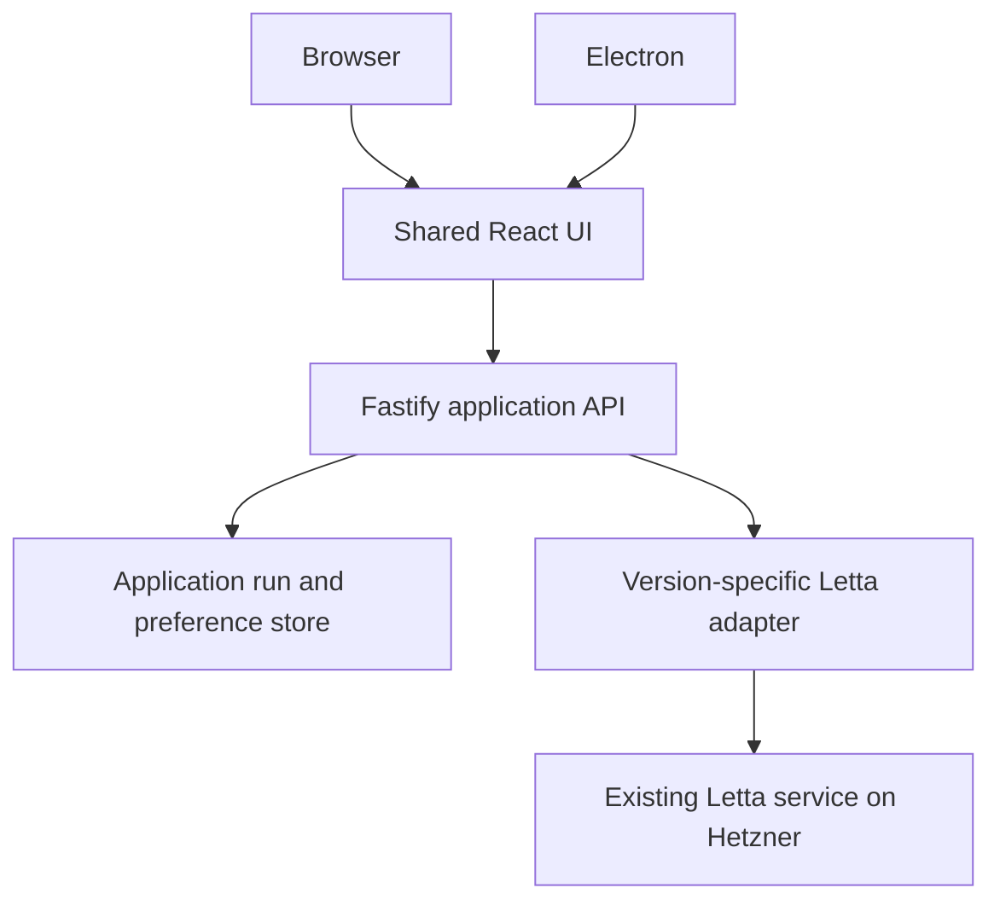
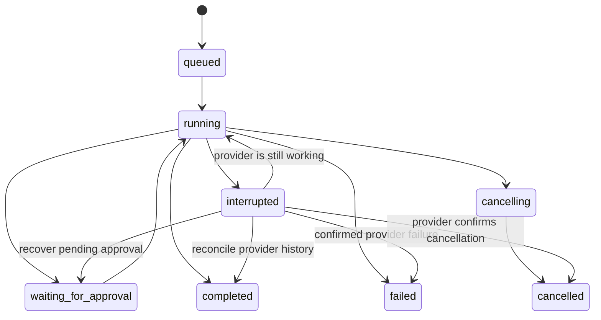

# Super System Agent Workspace - Plan

## Goal Capsule

Let Dennis chat with, inspect, and supervise his existing Letta agent on Hetzner from a polished browser interface and a desktop application.
The first release includes Home, Chat, Memory, Routines, Files, and System, with functionality determined by the connected server's verified capabilities.
Implementation is authorized; changing the existing Letta deployment or publishing publicly requires a concrete deployment decision.
Live verification requires the server address, authentication, and runtime version. Missing access must never be represented as a successful connection.

## Product Contract

### Summary

Build a personal agent workspace with a shared React interface, a thin Electron desktop shell, and an authenticated application API.
Keep Letta as the source of truth for agents, conversations, memory, provider files, and provider schedules.
Use Hermes Control Interface for operational ideas and Letta OSS UI for integration references; implement an original visual design and do not copy unlicensed source.

### Problem Frame

The agent already runs on a Hetzner VPS. Dennis needs one clear place to talk to it, understand its work, review its memory, and manage recurring work without moving the agent onto his Mac or assembling unrelated dashboards.

### Key Decisions

- **Connect to the existing Hetzner service.** Governs R1, R4. (session-settled: user-directed — chosen over moving Letta locally: the current agent already runs on Hetzner.)
- **Share the browser and desktop experience.** Governs R2, R3. (session-settled: user-approved — chosen over a desktop-only UI: both access modes are wanted.)
- **Build incrementally through the full agreed feature map.** Governs R5-R10. (session-settled: user-approved — chosen over stopping at a visual prototype: the user requested the full application.)

### Requirements

**Connection and access**

- R1. Connect to an explicitly configured Letta URL and existing agent; do not silently create or migrate the user's agent.
- R2. The main interface works in a browser and Electron with the same application API.
- R3. Desktop lifecycle, external links, notifications, and platform behavior are isolated from shared UI logic.
- R4. Provider credentials stay server-side; unauthenticated remote access is rejected and local access has origin/host protections.

**Agent workspace**

- R5. Home shows real connection state, work needing attention, recent activity, and available agent summaries; unconfigured and empty states remain useful without fabricated metrics.
- R6. Chat supports conversation selection/creation, message history, sending, streamed tool/text events, cancellation, approvals where supported, and recovery without automatically duplicating uncertain sends.
- R7. Memory supports viewing, searching, editing supported records, and revision comparison with honest history coverage and conflict handling.
- R8. Routines support listing, creation, deletion, and only the additional actions actually supported by the provider. Show target, timezone, schedule, and available run state.
- R9. Files show provider attachments and available context state; never imply that remote agents can see arbitrary Mac paths.
- R10. System shows connection diagnostics, provider capabilities, machines when available, application version, and theme/preferences.

**Design and reliability**

- R11. Use a calm workspace with a compact sidebar, spacious main canvas, optional detail inspector, light/dark themes, responsive layouts, keyboard access, and clear feedback for every action.
- R12. A capability distinguishes supported, unsupported, and unavailable behavior. Unsupported features cannot silently succeed or show invented data.
- R13. Application run records and audit/history state survive application restarts. Losing a client stream is distinct from a provider run failure; uncertain work is reconciled rather than automatically resent.
- R14. Closing the desktop UI does not itself cancel server-owned work. Explicit cancellation remains a separate action.

### Scope Boundaries

The first release is single-operator. Arbitrary terminal access, a Mac filesystem daemon, custom workflow scheduling, multi-provider parity, multi-user organizations, and billing are follow-up work.
The UI can show unsupported features with a clear explanation; this is not a substitute for implementing features the selected server does support.
Provider memory/history may differ between the legacy REST API and the current App Server. Compatibility is verified against the installed version before live mutations.

## Planning Contract

### Key Technical Decisions

- KTD1. **pnpm/TypeScript monorepo.** `apps/web` uses React/Vite; `apps/api` uses Fastify; `apps/desktop` uses Electron. `packages/core` owns transport-safe schemas; `packages/provider-letta` owns provider translation. (session-settled: user-approved — chosen over a Next.js frontend: this is a shared browser/desktop application without a server-rendering requirement.)
- KTD2. **Small capability-based provider contract.** Keep SDK types out of browser code. Separate agent identity, conversation identity, run identity, and machine identity.
- KTD3. **Server-owned sessions and events.** HTTP commands create persistent application run records; SSE carries replayable application events. The backend owns provider sessions independently of browser connections.
- KTD4. **Version-aware integration.** Support the documented legacy REST surface and current App Server through distinct adapters selected explicitly. Avoid guessing runtime generation from a successful generic health response.
- KTD5. **Persist only application state.** Use PostgreSQL/Drizzle for hosted state. A durable local file store can support zero-setup development through the same narrow storage interface; document its single-process restriction. Do not mirror Letta's entire database.
- KTD6. **Authentication and secret boundary.** Optional local-only development access is gated by explicit loopback, Host and Origin checks. Hosted deployments require a configured password/session secret, secure cookies, and HTTPS. No upstream raw errors or credentials in client responses.
- KTD7. **Thin desktop shell.** Electron displays the shared app URL with context isolation, sandboxing and no Node access in the renderer. Native capabilities are narrowly scoped. The backend remains independently available on Hetzner for hosted use.

### Architecture

### Run Lifecycle

A transport disconnect changes connection status, not run outcome. A backend restart marks unresolved local records interrupted until the provider confirms their state. A request id deduplicates application submissions; it does not claim exactly-once external tool execution.

### Assumptions and Dependencies

The initial visual identity is warm neutral surfaces, dark ink, a restrained green accent, readable typography, and compact operational details.
The server URL/version and credentials have been requested. Independently testable work proceeds while they are pending.
No existing application conventions or code are present beyond README and Apache-2.0 license.

## Implementation Units

### U1. Foundation and written architecture

- **Goal:** Establish installable workspace scripts, shared schemas, documentation, and clean package boundaries.
- **Files:** root manifests/configuration, `packages/core`, this plan, `docs/architecture.md`.
- **Dependencies:** none.
- **Requirements:** R1-R4, R11-R14; KTD1-KTD7.
- **Verification:** typecheck shared schemas; validate install and package resolution. Pure scaffolding needs no mirrored tests.

### U2. Provider integration and capability discovery

- **Goal:** Implement actual provider operations and explicit unavailable/unsupported outcomes.
- **Files:** `packages/provider-letta`.
- **Dependencies:** U1.
- **Requirements:** R1, R6-R10, R12; KTD2, KTD4.
- **Test scenarios:** normal REST response mapping, pagination, provider errors/redaction, streamed events across split chunks, unsupported endpoint handling, SDK event mapping, invalid configuration.
- **Verification:** focused provider tests with protocol fixtures; live read-only probe once access is available.

### U3. Application API and durable run coordination

- **Goal:** Provide authenticated commands, replayable events, persistent application records, and independent provider session lifetime.
- **Files:** `apps/api`, storage schema, API tests.
- **Dependencies:** U1; integrates U2 after its contract is available.
- **Requirements:** R4-R10, R12-R14; KTD3, KTD5, KTD6.
- **Test scenarios:** rejected anonymous remote access, hostile origins, credential redaction, duplicate send id, client disconnect, cancellation/approval, restart recovery, conflicting memory edit, failed provider writes without false success.
- **Verification:** Fastify injection integration tests and persistence/replay tests.

### U4. Shared browser workspace

- **Goal:** Implement all six navigation areas with real API actions, appropriate loading/empty/error states, and polished responsive design.
- **Files:** `apps/web`.
- **Dependencies:** U1; integrates U3 routes after their shared contract is available.
- **Requirements:** R2, R5-R12; KTD1-KTD3.
- **Test scenarios:** disconnected setup, login, keyboard navigation, conversation send/reconnect, approval card, memory search/edit/diff, routine form validation, unavailable capabilities, mobile sidebar and inspector.
- **Verification:** typecheck/build plus browser smoke flows using an explicitly isolated test provider and a live connection when available.

### U5. Electron application and deployment packaging

- **Goal:** Run the shared UI as a desktop app and document an independently hosted backend.
- **Files:** `apps/desktop`, `Dockerfile`, `compose.yaml`, deployment docs, environment examples.
- **Dependencies:** U1; integrates U3/U4 output.
- **Requirements:** R2-R4, R14; KTD6, KTD7.
- **Test scenarios:** invalid or unsafe app URLs rejected, external links constrained, no renderer Node access, close-window behavior, desktop boot to shared UI, container health and persistent storage.
- **Verification:** desktop build and launch smoke; production web/API build; container configuration validation where Docker is available.

### U6. Integration, live validation, and handoff

- **Goal:** Verify the integrated application against the actual Hetzner server and finish documentation.
- **Files:** integration fixes, `README.md`, `docs/deployment.md`, `docs/verification.md`, browser tests.
- **Dependencies:** U2-U5.
- **Requirements:** R1-R14.
- **Test scenarios:** reconnect to existing Memo; inspect real history/memory/files; send a user-authorized harmless message/tool call; restart UI without cancelling work; unsupported capabilities remain explicit.
- **Verification:** full typecheck, tests, production builds, browser/desktop inspection, independent code review, live evidence when access is supplied.

## Verification Contract

- `pnpm typecheck`: all packages compile without leaking server dependencies into browser code.
- `pnpm test`: contract, provider, persistence, authentication, and command lifecycle tests pass.
- `pnpm build`: browser, API, and desktop outputs build.
- `pnpm test:e2e`: isolated browser flows verify functional UI behavior with known provider fixtures.
- Live verification is reported separately from fixture-backed verification. Missing access remains an explicit blocker to claiming production readiness.
- Real scheduled work, destructive edits, and broad remote filesystem actions are not used as smoke tests.

## Definition of Done

All six areas are implemented against the capability contract, the browser and desktop share the same UI, authentication and durable run behavior are verified, and documentation explains setup and deployment.
Every implementation unit has observed verification evidence or an explicit environmental blocker in `docs/verification.md`.
No production screen depends on test fixtures, fake counts, or placeholder successful actions.
No abandoned experimental code or unneeded scaffolding remains.
The final report distinguishes locally verified functionality from live Hetzner validation and any provider limitations.

## Appendix

- [Letta integration patterns](https://docs.letta.com/platform/app-server/integration-patterns)
- [Letta deployment and runtime selection](https://docs.letta.com/agent-sdk/deployment)
- [Letta session durability](https://docs.letta.com/agent-sdk/sessions)
- [Hermes Control Interface](https://github.com/xaspx/hermes-control-interface)
- [Letta OSS UI reference](https://github.com/letta-ai/letta-oss-ui)
- [Electron security](https://www.electronjs.org/docs/latest/tutorial/security)
